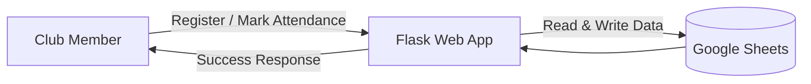
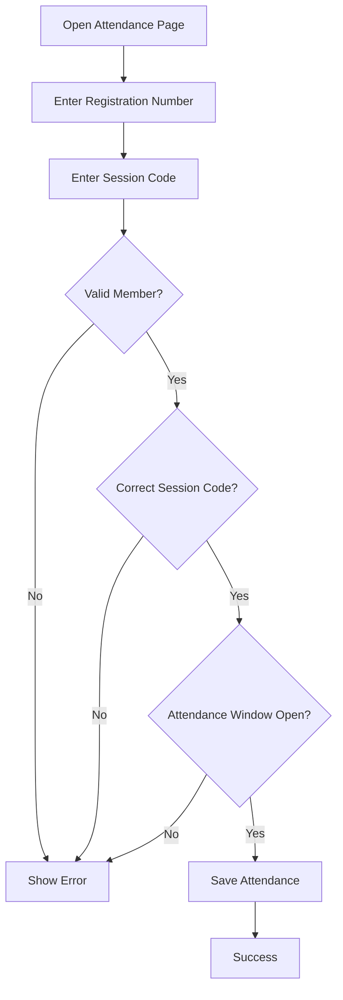
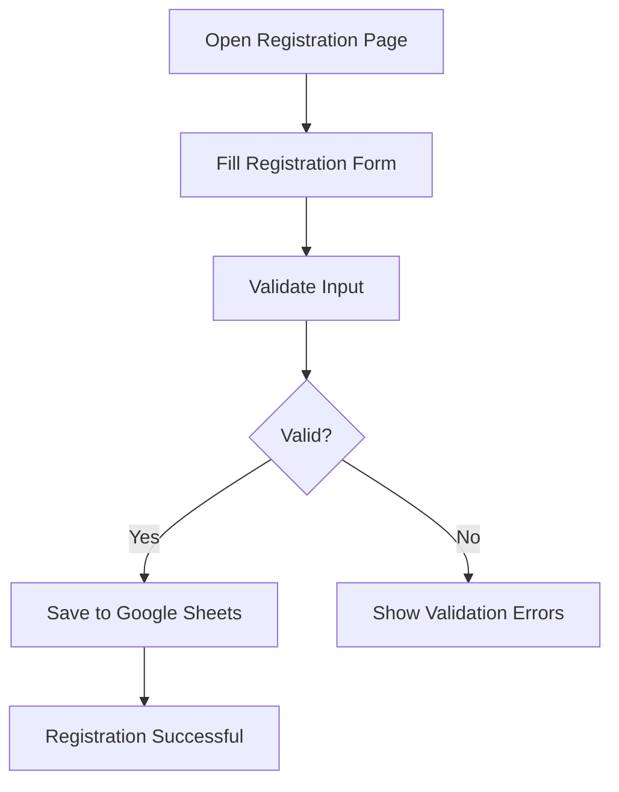
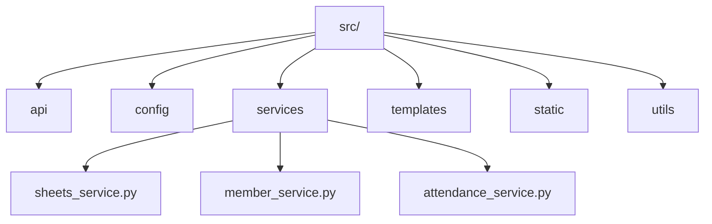
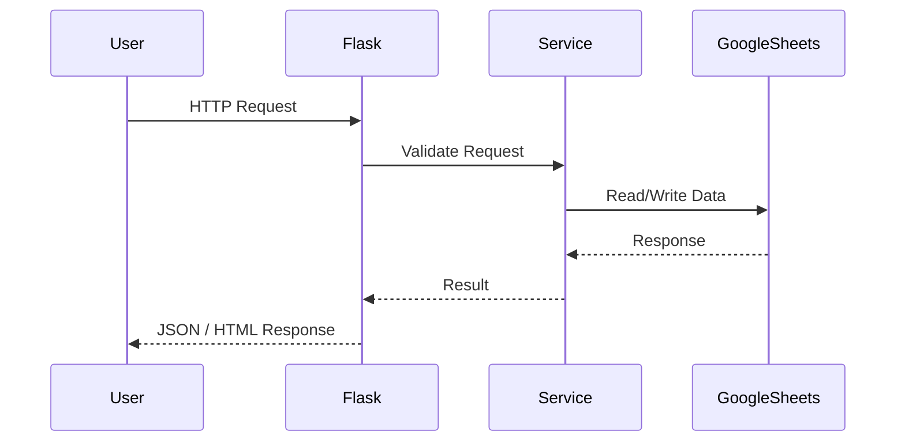
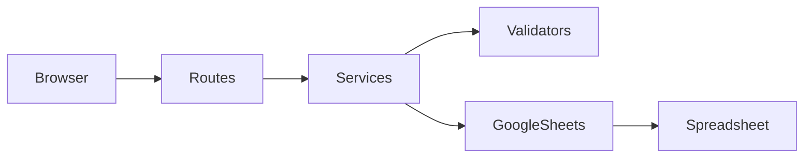
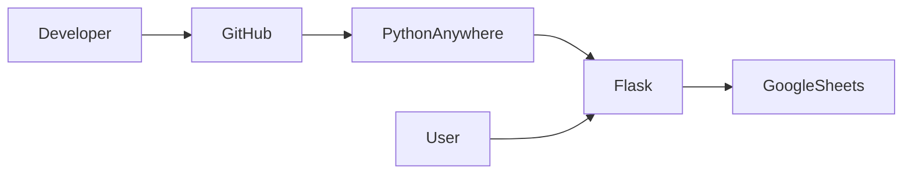
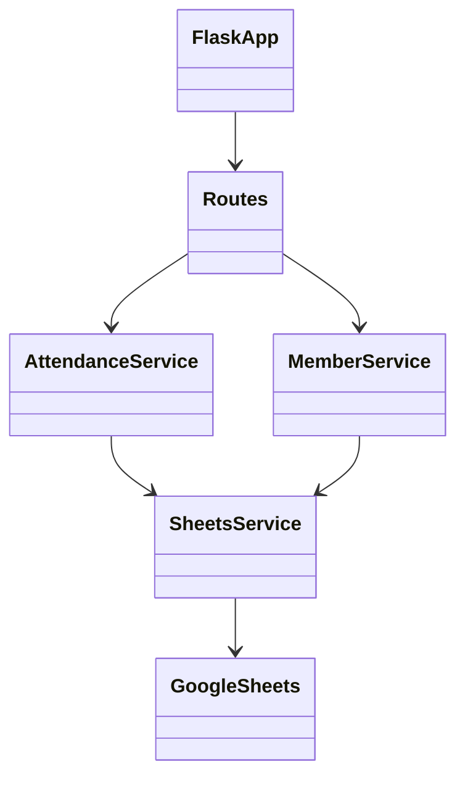

<div align="center">

# ICT Club Attendance Tracker

**✨ Simple. Fast. Digital. ✨**

*Mark your presence in under 1 minute!*

---

### 🚀 Built With

[](https://www.python.org/)
[](https://flask.palletsprojects.com/)
[](https://developer.mozilla.org/docs/Web/HTML)
[](https://developer.mozilla.org/docs/Web/CSS)
[](https://developer.mozilla.org/docs/Web/JavaScript)
[](https://developers.google.com/sheets/api)
[](https://console.cloud.google.com/)
[](#)

---

### 📦 Deployment

[](https://www.pythonanywhere.com/)
[](#)
[](#)

---

### 📊 Project Status


---

### ⭐ GitHub


---

### 🧪 Quality


---

**[📖 Documentation](docs/)** •
**[🚀 Quick Start](#-for-developers-complete-setup-guide)** •
**[👨‍🎓 Club Members](#-for-club-members-how-to-use)** •
**[👨‍💻 Developers](#-for-developers-complete-setup-guide)** •
**[🤝 Contributing](CONTRIBUTING.md)**

</div>

---

## TABLE OF CONTENTS

- [What Is This?](#-what-is-this)
- [For Club Members (How to Use)](#-for-club-members-how-to-use)
- [Weekly Schedule](#-weekly-schedule)
- [For Developers (Complete Setup Guide)](#-for-developers-complete-setup-guide)
  - [Prerequisites](#prerequisites)
  - [Python Installation](#1-install-python)
  - [Project Setup](#2-clone-and-setup-project)
  - [Google Cloud Setup](#3-google-cloud-setup-complete-guide)
  - [Google Sheets Setup](#4-google-sheets-setup)
  - [Running Locally](#5-run-the-application-locally)
  - [Deployment to PythonAnywhere](#6-deployment-to-pythonanywhere)
- [System Architecture](#-system-architecture)
- [Features](#-features)
- [FAQ](#-frequently-asked-questions-faq)
- [Troubleshooting](#%EF%B8%8F-troubleshooting)
- [Support & Contact](#-support--contact)

---

## WHAT IS THIS?

This is the **ICT Club's Digital Attendance System**. Instead of signing paper sheets every session, you can now mark your attendance using your phone or computer in just a few taps!

**No more:**
- Waiting in line to sign paper sheets
- Lost or damaged attendance records
- Illegible handwriting
- Time wasted during sessions

**Now you get:**
-  Mark attendance from anywhere (classroom, home, or on campus)
-  Instant confirmation of your attendance
-  Safe and secure digital records
-  Quick and easy process (less than 1 minute!)

---
# Higher Level Arch
1. System Overview

2. Attendance Flow

3. Registration Flow

4. Project Structure

5. Request Lifecycle

6. Application Components

7. Deployment Architecture

8. Component Relationship



## FOR CLUB MEMBERS (HOW TO USE)

### 📱 Step 1: First Time? Register Yourself

If you're new to the ICT Club:

1. **Open the system link** (shared in WhatsApp group)
2. **Fill in your details**:
   - Registration Number (e.g., `T/DEG/2024/123`)
   - Full Name
   - Email Address
   - Phone Number
   - Department(s) you're interested in
   - Year of Study
   - Gender
3. **Click "Register"**
4. You're done!

> **Note**: You only need to register ONCE. After that, just use your registration number to mark attendance.

---

### Step 2: Mark Your Attendance Every Friday

Every Friday during club sessions (1:30 PM - 3:30 PM):

1. **Open the attendance system link**
2. **Enter your Registration Number** (e.g., `T/DEG/2024/123`)
3. **Enter the Session Code** (announced by department leaders)
4. **Click "Mark Attendance"**
5. You'll see a success message!

> **⏰ Attendance Window**: You can mark attendance from Friday 1:00 PM until Saturday 12:00 AM (midnight). Don't miss it!

---

## WEEKLY SCHEDULE

Every Friday, a different department presents. Here's the 6-week rotation:

| Week | Department | Session Code Format | Time |
|------|------------|---------------------|------|
| 1 | **Networking** | `NETddMMM` | 13:30-15:30 |
| 2 | **Computer Maintenance** | `COMPddMMM` | 13:30-15:30 |
| 3 | **Graphic Design** | `GRAPHddMMM` | 13:30-15:30 |
| 4 | **AI & Machine Learning** | `AIddMMM` | 13:30-15:30 |
| 5 | **Cybersecurity** | `CYBERddMMM` | 13:30-15:30 |
| 6 | **Programming** | `PROGddMMM` | 13:30-15:30 |

*Example: `NET30JAN` for Networking on January 30th*

> **💡 Pro Tip**: The session code changes every week for security. Always wait for the official announcement during the session!

---

## 💻 FOR DEVELOPERS (COMPLETE SETUP GUIDE)

### Prerequisites

Before you begin, ensure you have:
- A computer (Windows, Mac, or Linux)
- Internet connection
- A Gmail account (for Google Cloud)
- Basic command line knowledge (optional but helpful)

---

### 1. INSTALL PYTHON

#### **Windows:**

1. **Download Python**:
   - Visit: https://www.python.org/downloads/
   - Click "Download Python 3.9+" (or latest version)
   - Run the installer (`.exe` file)

2. **During Installation**:
   -  **CHECK**: "Add Python to PATH" (IMPORTANT!)
   - Click "Install Now"
   - Wait for installation to complete

3. **Verify Installation**:
   ```bash
   # Open Command Prompt (cmd) and type:
   python --version
   # Should show: Python 3.9.x or higher
   
   pip --version
   # Should show: pip 21.x.x or higher
   ```

#### **Mac:**

1. **Check if Python is installed**:
   ```bash
   python3 --version
   ```

2. **If not installed, use Homebrew**:
   ```bash
   # Install Homebrew (if not installed)
   /bin/bash -c "$(curl -fsSL https://raw.githubusercontent.com/Homebrew/install/HEAD/install.sh)"
   
   # Install Python
   brew install python@3.9
   ```

3. **Verify Installation**:
   ```bash
   python3 --version
   pip3 --version
   ```

#### **Linux (Ubuntu/Debian):**

```bash
# Update package list
sudo apt update

# Install Python 3.9+
sudo apt install python3 python3-pip python3-venv

# Verify installation
python3 --version
pip3 --version
```

---

### 2. CLONE AND SETUP PROJECT

#### **Option A: Download from GitHub**

```bash
# Clone the repository
git clone https://github.com/your-organization/ict-club-attendance-api.git

# Navigate to project directory
cd ict-club-attendance-api
```

#### **Option B: Download ZIP File**

1. Download the project ZIP from GitHub
2. Extract to a folder (e.g., `C:\Projects\ict-club-attendance-api`)
3. Open terminal/command prompt in that folder

---

### 3. CREATE VIRTUAL ENVIRONMENT

A virtual environment keeps your project dependencies isolated.

```bash
# Create virtual environment
python -m venv venv

# Activate virtual environment
# On Windows:
venv\Scripts\activate

# On Mac/Linux:
source venv/bin/activate

# You should see (venv) at the start of your command line
```

---

### 4. INSTALL DEPENDENCIES

```bash
# Make sure virtual environment is activated (you should see (venv))
# Install all required packages
pip install -r requirements.txt

# Wait for installation to complete (~2-5 minutes)
```

**Required Packages** (automatically installed):
- Flask 3.0.0 - Web framework
- gspread 5.12.4 - Google Sheets integration
- oauth2client 4.1.3 - Google authentication
- python-dotenv 1.0.0 - Environment variables
- pytz 2023.3 - Timezone handling
- Flask-CORS 4.0.0 - Cross-origin requests

---

### 5. GOOGLE CLOUD SETUP (COMPLETE GUIDE)

This is the most important part! Follow carefully.

#### **Step 5.1: Create Google Cloud Project**

1. **Go to Google Cloud Console**:
   - Visit: https://console.cloud.google.com/
   - Sign in with your Gmail account (preferably ICT Club email)

2. **Accept Terms** (first-time only):
   - Read and check ☑ "I agree to the Terms of Service"
   - Click "AGREE AND CONTINUE"

3. **Create New Project**:
   - Click the **project dropdown** at the top (near "Google Cloud" logo)
   - Click **"NEW PROJECT"**
   - Fill in:
     ```
     Project name: ICT-Club-Attendance
     Organization: No organization
     Location: No organization
     ```
   - Click **"CREATE"**
   - Wait ~30 seconds

4. **Verify Project is Selected**:
   - Look at top bar, should show: "ICT-Club-Attendance"
   - If not, click dropdown and select your project

---

#### **Step 5.2: Enable Google Sheets API**

1. **Navigate to APIs & Services**:
   - Click ☰ hamburger menu (top-left)
   - Click **"APIs & Services"** → **"Library"**

2. **Enable Google Sheets API**:
   - In search box, type: `Google Sheets API`
   - Click on **"Google Sheets API"**
   - Click **"ENABLE"** button
   - Wait for confirmation

3. **Enable Google Drive API** (also required):
   - Click "← APIs & Services" to go back
   - Click **"Library"** again
   - Search: `Google Drive API`
   - Click on **"Google Drive API"**
   - Click **"ENABLE"**

---

#### **Step 5.3: Create Service Account**

1. **Go to Credentials**:
   - Click ☰ hamburger menu
   - **"APIs & Services"** → **"Credentials"**

2. **Create Service Account**:
   - Click **"+ CREATE CREDENTIALS"** (top)
   - Select **"Service Account"**

3. **Fill in Service Account Details**:
   ```
   Service account name: ict-club-attendance-sa
   Service account ID: (auto-generated, e.g., ict-club-attendance-sa@xxx.iam.gserviceaccount.com)
   Description: Service account for ICT Club attendance system
   ```
   - Click **"CREATE AND CONTINUE"**

4. **Grant Permissions** (SKIP THIS):
   - Just click **"CONTINUE"** (no roles needed)

5. **Grant Users Access** (SKIP THIS):
   - Click **"DONE"**

---

#### **Step 5.4: Generate Credentials JSON File**

1. **Find Your Service Account**:
   - On the "Credentials" page
   - Scroll down to **"Service Accounts"** section
   - You'll see your service account email (e.g., `ict-club-attendance-sa@xxx.iam.gserviceaccount.com`)
   - **Click on the email**

2. **Create Key**:
   - Click the **"KEYS"** tab (top menu)
   - Click **"ADD KEY"** button
   - Select **"Create new key"**

3. **Download JSON Key**:
   - Select **"JSON"** format
   - Click **"CREATE"**
   - A JSON file will download automatically (e.g., `ict-club-attendance-xxxxxx.json`)

4. **Save the File**:
   - **Rename it to**: `credentials.json`
   - **Move it to your project folder**: `ict-club-attendance-api/credentials.json`
   - **⚠️ IMPORTANT**: Keep this file SECRET! Never share it or upload to GitHub!

5. **Copy Service Account Email**:
   - Copy the service account email (e.g., `ict-club-attendance-sa@xxx.iam.gserviceaccount.com`)
   - You'll need this in the next step!

---

### 6. GOOGLE SHEETS SETUP

#### **Step 6.1: Create Google Sheets**

1. **Open Google Sheets**:
   - Visit: https://sheets.google.com/
   - Sign in with the same Gmail account used for Google Cloud

2. **Create New Spreadsheet**:
   - Click **"+ Blank"** to create a new sheet
   - **Rename it**: "ICT Club Attendance" (click top-left "Untitled spreadsheet")

3. **Create "Members" Sheet**:
   - The first sheet is already created
   - **Rename it** to: `Members` (double-click "Sheet1" tab at bottom)
   - Add headers in Row 1:
     ```
     A1: reg_number
     B1: name
     C1: email
     D1: phone
     E1: departments
     F1: year_of_study
     G1: gender
     H1: registration_date
     ```

4. **Create "Attendance_2026" Sheet**:
   - Click **"+" button** at bottom-left (next to "Members" tab)
   - Rename new sheet to: `Attendance_2026`
   - Add headers in Row 1:
     ```
     A1: reg_number
     B1: name
     (Dates will be added automatically by the system, e.g., C1: 2026-01-30, D1: 2026-02-06, etc.)
     ```

---

#### **Step 6.2: Share Sheets with Service Account**

This is CRITICAL! The system can't access the sheets without this.

1. **Click "Share" button** (top-right corner of Google Sheets)

2. **Add Service Account**:
   - Paste your **service account email** (from Step 5.4.5)
   - Example: `ict-club-attendance-sa@xxx.iam.gserviceaccount.com`

3. **Set Permission**:
   - Change permission to: **"Editor"**
   - Uncheck "Notify people" (service accounts don't get emails)

4. **Click "Share"** or "Send"

5. **Copy Spreadsheet ID**:
   - Look at the URL in your browser
   - URL format: `https://docs.google.com/spreadsheets/d/SPREADSHEET_ID_HERE/edit`
   - **Copy the SPREADSHEET_ID** (long string between `/d/` and `/edit`)
   - Example: `1AbC2dEfGhIjKlMnOpQrStUvWxYz123456789`

---

### 7. CONFIGURE ENVIRONMENT VARIABLES

1. **Create `.env` file** in project root:
   ```bash
   # In the ict-club-attendance-api folder, create a new file named .env
   # On Windows: type nul > .env
   # On Mac/Linux: touch .env
   ```

2. **Open `.env` file** in a text editor (Notepad, VS Code, etc.)

3. **Add configuration**:
   ```env
   # Flask Configuration
   FLASK_APP=src/app.py
   FLASK_ENV=development
   SECRET_KEY=your-secret-key-change-this-in-production
   
   # Google Sheets Configuration
   SPREADSHEET_ID=YOUR_SPREADSHEET_ID_HERE
   CREDENTIALS_FILE=credentials.json
   
   # Timezone
   TIMEZONE=Africa/Dar_es_Salaam
   
   # Application Settings
   DEBUG=True
   PORT=5000
   ```

4. **Replace `YOUR_SPREADSHEET_ID_HERE`** with the ID you copied in Step 6.2.5

5. **Save the file**

---

### 8. VERIFY PROJECT STRUCTURE

Your project should look like this:

```
ict-club-attendance-api/
├── credentials.json          # ← Google Cloud credentials (SECRET!)
├── .env                      # ← Environment variables (SECRET!)
├── .gitignore               # ← Git ignore file
├── requirements.txt          # ← Python dependencies
├── README.md                # ← This file
├── venv/                    # ← Virtual environment (don't touch)
│
├── src/                     # ← Main application code
│   ├── app.py              # ← Flask app entry point
│   ├── config/             # ← Configuration files
│   │   ├── __init__.py
│   │   ├── config.py       # ← App configuration
│   │   └── sessions.py     # ← Session codes (update weekly!)
│   │
│   ├── api/                # ← API routes
│   │   ├── __init__.py
│   │   └── routes.py       # ← API endpoints
│   │
│   ├── services/           # ← Business logic
│   │   ├── __init__.py
│   │   ├── sheets_service.py      # ← Google Sheets operations
│   │   ├── member_service.py      # ← Member management
│   │   └── attendance_service.py  # ← Attendance logic
│   │
│   ├── utils/              # ← Helper functions
│   │   ├── __init__.py
│   │   └── validators.py  # ← Input validation
│   │
│   ├── templates/          # ← HTML templates
│   │   ├── index.html
│   │   ├── register.html
│   │   └── attendance.html
│   │
│   └── static/             # ← CSS, JS, images
│       ├── css/
│       ├── js/
│       └── images/
│
├── docs/                    # ← Documentation
│   ├── API_DOCUMENTATION.md
│   ├── DEPLOYMENT_GUIDE.md
│   └── SYSTEM_ARCHITECTURE.md
│
└── scripts/                 # ← Deployment scripts
    ├── deploy.sh
    └── pythonanywhere_deploy.sh
```

---

### 9. RUN THE APPLICATION LOCALLY

Time to test if everything works!

```bash
# Make sure you're in the project directory
cd ict-club-attendance-api

# Make sure virtual environment is activated
# You should see (venv) at the start of your command line
# If not:
# Windows: venv\Scripts\activate
# Mac/Linux: source venv/bin/activate

# Navigate to src folder
cd src

# Run the application
python app.py
```

**Expected Output**:
```
 * Serving Flask app 'app'
 * Debug mode: on
WARNING: This is a development server. Do not use it in a production deployment.
 * Running on http://127.0.0.1:5000
Press CTRL+C to quit
```

**Test the Application**:
1. Open your browser
2. Go to: `http://localhost:5000`
3. You should see the attendance system homepage!

**Test Registration**:
1. Go to: `http://localhost:5000/register`
2. Fill in a test member
3. Submit
4. Check your Google Sheet - new member should appear!

---

### 10. DEPLOYMENT TO PYTHONANYWHERE

Now let's deploy to the internet so everyone can access it!

#### **Step 10.1: Create PythonAnywhere Account**

1. **Visit**: https://www.pythonanywhere.com/
2. Click **"Start running Python online"** or **"Pricing & signup"**
3. Choose **"Beginner" plan** (FREE)
4. Create account with email/password
5. Verify your email

---

#### **Step 10.2: Upload Code to PythonAnywhere**

**Option A: Using Git (Recommended)**

1. **Open Bash Console**:
   - In PythonAnywhere dashboard, click **"Consoles"** tab
   - Click **"Bash"** to open a new console

2. **Clone Repository**:
   ```bash
   git clone https://github.com/your-organization/ict-club-attendance-api.git
   cd ict-club-attendance-api
   ```

**Option B: Upload Files Manually**

1. **In PythonAnywhere**, click **"Files"** tab
2. Navigate to `/home/YOUR_USERNAME/`
3. Click **"Upload a file"**
4. Upload your project files (or use **"Upload Directory"**)

---

#### **Step 10.3: Upload Credentials File**

**IMPORTANT**: Don't upload `credentials.json` to GitHub!

1. **In PythonAnywhere Files tab**:
   - Navigate to `/home/YOUR_USERNAME/ict-club-attendance-api/`
   - Click **"Upload a file"**
   - Upload your `credentials.json` file

---

#### **Step 10.4: Install Dependencies**

1. **Open Bash Console** (if not already open)
2. **Navigate to project**:
   ```bash
   cd ~/ict-club-attendance-api
   ```

3. **Create virtual environment**:
   ```bash
   mkvirtualenv --python=/usr/bin/python3.9 attendenv
   ```

4. **Install dependencies**:
   ```bash
   pip install -r requirements.txt
   ```

---

#### **Step 10.5: Configure Web App**

1. **Go to "Web" tab** in PythonAnywhere dashboard
2. Click **"Add a new web app"**
3. Click **"Next"** (accept free subdomain)
4. Select **"Manual configuration"**
5. Choose **"Python 3.9"**
6. Click **"Next"**

---

#### **Step 10.6: Configure WSGI File**

1. **On Web tab**, scroll to **"Code"** section
2. Click on **"WSGI configuration file"** link
3. **Delete all content** and replace with:

```python
import sys
import os

# Add your project directory to the sys.path
project_home = '/home/YOUR_USERNAME/ict-club-attendance-api'
if project_home not in sys.path:
    sys.path.insert(0, project_home)

# Set environment variables
os.environ['SPREADSHEET_ID'] = 'YOUR_SPREADSHEET_ID_HERE'
os.environ['CREDENTIALS_FILE'] = '/home/YOUR_USERNAME/ict-club-attendance-api/credentials.json'
os.environ['TIMEZONE'] = 'Africa/Dar_es_Salaam'

# Import Flask app
from src.app import app as application
```

4. **Replace**:
   - `YOUR_USERNAME` with your PythonAnywhere username
   - `YOUR_SPREADSHEET_ID_HERE` with your Google Sheets ID

5. **Save the file**

---

#### **Step 10.7: Set Virtual Environment**

1. **On Web tab**, scroll to **"Virtualenv"** section
2. **Enter path**:
   ```
   /home/YOUR_USERNAME/.virtualenvs/attendenv
   ```
3. Click checkmark to save

---

#### **Step 10.8: Set Static Files**

1. **On Web tab**, scroll to **"Static files"** section
2. Click **"Enter path"**
3. Add:
   ```
   URL: /static
   Directory: /home/YOUR_USERNAME/ict-club-attendance-api/src/static
   ```

---

#### **Step 10.9: Reload and Test**

1. **Click green "Reload" button** at top of Web tab
2. **Wait ~10 seconds**
3. **Click on your website link** (e.g., `YOUR_USERNAME.pythonanywhere.com`)
4. **Test the system!**

**Troubleshooting**:
- If you see errors, click **"Log files"** section on Web tab
- Check **"Error log"** for details
- Common issues:
  - Wrong file paths in WSGI
  - Missing credentials.json
  - Wrong spreadsheet ID

---

##  SYSTEM ARCHITECTURE

### How It Works

```
┌─────────────────────────────────────────────────┐
│         USER (Phone/Computer Browser)           │
│              Opens: your-app.com                 │
└────────────────┬────────────────────────────────┘
                 │
                 ▼
┌─────────────────────────────────────────────────┐
│            FLASK WEB APPLICATION                 │
│  ┌──────────────┐  ┌───────────────────────┐   │
│  │   Routes     │──│   Business Logic      │   │
│  │  (API URLs)  │  │   (Validators)        │   │
│  └──────────────┘  └───────────────────────┘   │
└────────────────┬────────────────────────────────┘
                 │
                 ▼
┌─────────────────────────────────────────────────┐
│          GOOGLE SHEETS API                       │
│  ┌──────────────────┐  ┌──────────────────────┐│
│  │  Members Sheet   │  │  Attendance_2026     ││
│  │  (Member Data)   │  │  (Attendance Data)   ││
│  └──────────────────┘  └──────────────────────┘│
└─────────────────────────────────────────────────┘
```

### API Endpoints

| Endpoint | Method | Description |
|----------|--------|-------------|
| `/` | GET | Homepage |
| `/register` | GET | Registration form |
| `/api/register` | POST | Register new member |
| `/api/check-member` | POST | Verify member exists |
| `/api/mark-attendance` | POST | Mark attendance |
| `/api/session-info` | GET | Get current session info |

---

## ✨ FEATURES

### Core Features

1. **Member Registration**
   - Self-registration for new members
   - Registration number validation (`T/DEG/YYYY/XXX` or `T/DIP/YYYY/XXX`)
   - Multi-department membership support
   - Stores: name, email, phone, gender, year of study

2. **Attendance Marking**
   - Session code validation (changes weekly)
   - Time-window enforcement (Friday 13:00 → Saturday 00:00)
   - Duplicate attendance prevention
   - Instant confirmation messages

3. **Session Management**
   - 6 rotating departments (weekly schedule)
   - Hardcoded session codes for security
   - Automatic session detection based on date

4. **Data Storage**
   - Real-time Google Sheets integration
   - Members sheet with all registered members
   - Attendance sheet with date-based columns
   - Automatic data backup

5. **User Interface**
   - Simple and clean design
   - Mobile-responsive (works on all devices)
   - Two-step process: Reg Number → Session Code
   - Clear error messages

### Security Features

- Registration number format validation
- Session code validation (weekly changes)
- Time-window enforcement
- Duplicate attendance prevention
- Service account authentication (Google Sheets)
- Environment variables for sensitive data

---

## FREQUENTLY ASKED QUESTIONS (FAQ)

### For Club Members

**Q: What if I forget my registration number?**  
**A:** Check your student ID card. Your registration number is your university registration number (e.g., T/DEG/2024/123).

**Q: Can I mark attendance after the session ends?**  
**A:** Yes! You have until Saturday midnight (11 hours after the session) to mark attendance.

**Q: What if I enter the wrong session code?**  
**A:** The system will reject it and show an error. Make sure you get the correct code from the department leader during the session.

**Q: Can I belong to multiple departments?**  
**A:** Absolutely! During registration, you can select multiple departments.

**Q: Do I need internet to use this?**  
**A:** Yes, you need internet connection (campus WiFi or mobile data).

### For Developers

**Q: Can I use Python 3.8 or older?**  
**A:** No, Python 3.9+ is required for compatibility with Flask 3.0.

**Q: Why use Google Sheets instead of a database?**  
**A:** Google Sheets is free, easy to setup, accessible to non-technical club leaders, and sufficient for our needs (~60 members).

**Q: Can I deploy to Heroku instead of PythonAnywhere?**  
**A:** Yes, but you'll need to adjust the deployment scripts. PythonAnywhere is recommended for beginners.

**Q: How do I update session codes weekly?**  
**A:** Edit `src/config/sessions.py` file and add new session codes following the existing format.

**Q: Is this system scalable?**  
**A:** For 100-200 members, yes. Beyond that, consider migrating to PostgreSQL or MongoDB.

---

## TROUBLESHOOTING

### Common Issues

**Problem**: "Module not found" error  
**Solution**: Make sure virtual environment is activated and all dependencies are installed (`pip install -r requirements.txt`)

**Problem**: "Invalid credentials" error  
**Solution**: Check that `credentials.json` exists and `SPREADSHEET_ID` is correct in `.env` file

**Problem**: "Permission denied" when accessing sheets  
**Solution**: Make sure you shared the Google Sheet with your service account email (Editor permission)

**Problem**: "Invalid registration number" error  
**Solution**: Registration number must follow format: `T/DEG/YYYY/XXX` or `T/DIP/YYYY/XXX`

**Problem**: "Session not open" error  
**Solution**: Attendance can only be marked between Friday 1:00 PM and Saturday 12:00 AM

**Problem**: Application not loading on PythonAnywhere  
**Solution**: Check error logs on Web tab, verify WSGI configuration, and ensure virtual environment is set correctly

---

## 🔮 FUTURE ENHANCEMENTS

Planned features for upcoming versions:

- **Admin Dashboard** - View reports and statistics
- **Email Reminders** - Automatic session reminders
- **QR Code Check-in** - Faster attendance marking
- **Analytics** - Attendance trends and insights
- **Offline Mode** - Mark attendance without internet
- **Certificates** - Auto-generate based on attendance
- **Push Notifications** - Mobile alerts for sessions
- **Mobile App** - Native iOS/Android apps

---

## 📞 SUPPORT & CONTACT

### Need Help?

- **During Sessions**: Ask session presenters or club leaders
- **Technical Issues**: Contact ICT Club technical team
- **General Questions**: Message the club WhatsApp group

### Club Contact

- **Email**: ictclub@example.com
- **Location**: Your Institution
- **Meeting Time**: Check with your club schedule

---

## 🙏 ACKNOWLEDGMENTS

Special thanks to:
- **ICT Club Leaders** - For guidance and support
- **Club Members** - For embracing digital transformation
- **Faculty Advisor** - For approving this initiative
- **Department Heads** - For coordinating sessions
- **Open Source Community** - For Flask, Python, and amazing tools

---

## LICENSE

This project is developed for ICT Club. See [LICENSE](LICENSE) file for details.

---

<div align="center">

**🎓 ICT CLUB**

*Empowering students through technology*

---

**Built with ❤️ by ICT Club Development Team**

*Version 1.0*

---

[📖 View Documentation](docs/) • [🐛 Report Bug](https://github.com/mwecauict-club/ict-club-attendance-api/issues) • [💡 Request Feature](https://github.com/mwecauict-club/ict-club-attendance-api/issues)
Made with ❤️ for the Open Source Community.

If you improve this project, please contribute your enhancements back so the community can benefit.
</div>
